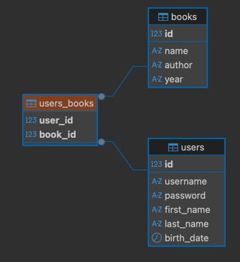

# Setup

1. Install Docker for your device https://docs.docker.com/desktop/
2. Install dependencies - `npm install`
3. Then add .env file in the root of the project with the following content:
4. ```
    POSTGRES_USER=user
    POSTGRES_PASSWORD=local_pass
    POSTGRES_HOST=localhost
    POSTGRES_DB=books_store
    POSTGRES_DB_PORT=5433
   ```
5. run `docker compose up` to start the local database
  - If port 5432 is in use, change the port in docker-compose.yml to an available port (e.g. 5433) and update the .env file accordingly.

Since we will be using PostgreSQL, you need to have it installed and running. For this we are adding `pq`, and `knex` as dependencies.
We will also need .env to load variables for our database, making our application more production ready.

For knex we need to have a `knexfile.ts` in the root of the project. This file contains the database connection
information and other settings for knex. For this we created [./knexfile.ts](knexfile.ts).
(for a new project you would run `npx knex init -x ts` to create the file)

# Migrations

With knex you can easily create and run migrations to manage your database schema.

We will be creating a simple database with 2 tables: users and books. A user can have many books.



1. Create a migration - `knex migrate:make users -x ts`
2. Populate the table (see [migrations/20250510132026_users.ts](migrations/20250510132026_users.ts))
3. Run the migration - `knex migrate:latest`

## (optional) Making default data for development

You can also have a pre-defined set of data in your database for development purposes. This is done using seeds.

1. Create a seed - `knex seed:make first-users -x ts`
2. Populate the seed (see [seeds/01-first-users.ts](seeds/01-first-users.ts))
3. Run the seed - `knex seed:run`

# Homework

Expand the Koa API and load data from the PostgreSQL database using Knex:

- Load a single users and all their books
- Remove a book from a user
- Add a new book
- Update a book name
- Find a book by name
  - Can you list all the users that have a book written by "J.R.R. Tolkien" 

## Improvements

- A Book by the same author should not be added twice in the books table
- How can you handle the same user being created twice?
- How can you fix the "author" name changing for a book?
  - Consider that if we update 1 book, the name of the author is also relevant for the other books written by them
- Optional: 
  - How could you use a post processing response request to always hide the password of the user or omit it when retrieving the result?
  - Can you change password for a user and make it protected? (hint checkout bcrypt)
